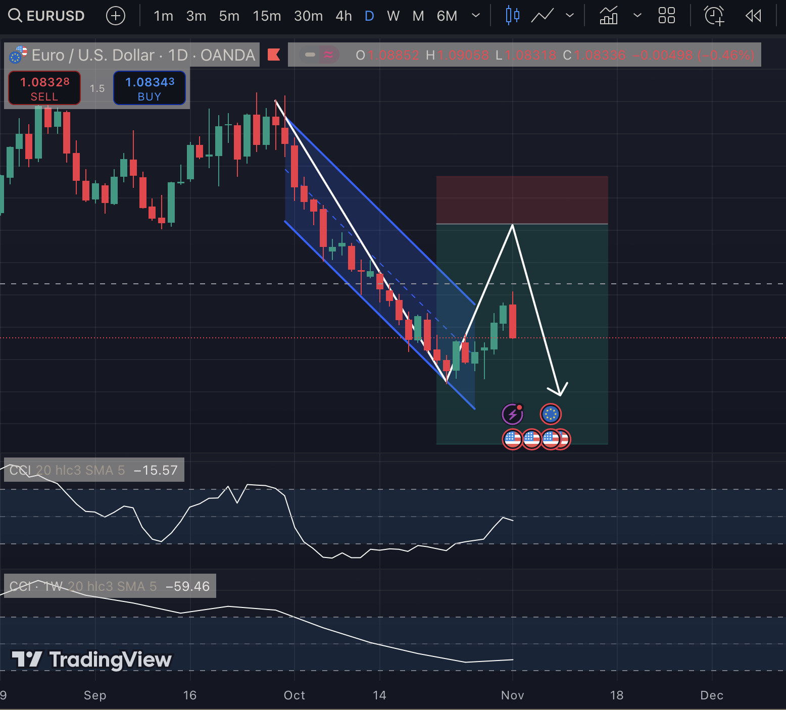

# Iceberg: Forex-Algo:Java for Momentum & Reversal Trading

## How to Run

- Clone the repository.
  
  ```shell
  git clone https://github.com/anurag-sachan/Rust-TradingView-Stock-Screener.git
  ```

- Pre-requisites :
  
    > Install and setup Java

    > Navigate to directory containing `Main.java`


## Screenshot: What it does?

  > Prop: FundingPips APIs for Alerts and Exits.

  > Alerts through Mail, based on indicator / target prices.

  > Momentum Detection: Analyzes the (1D & 1W) timeframe to determine momentum and identify trending pairs.

  > Reversal Recognition: Uses (4H & 1D) candles to confirm reversal signals.

  > Trade Alerts: Trades on ( candles, with 4H/1D timeframe exits, to capture trade along with momentum.

 


<br/>
Thanks,

Anurag.
